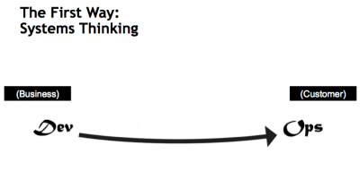

# What are the "Three Ways"

> - The "Three Ways" are the principles that all of the DevOps patterns can be derived from
> - They are pesented in the "DevOps Handbook" and "The Phoenix Project" books
> - Describe the values and philosophies that frame the processes, procedures, practices of DevOps, as well as the prescriptive steps.

# The First Way

> - Emphasizes the performance of the entire system, as opposed to the performance of a specific silo or work or department.
> - Focuses on all the business value streams that are enabled by IT
> - It begins when the requirements are identified and ends when the value is delivered to the customer as a form of service.

# Outcomes of the First Way include:

> - Never passing a known defect to downstream work centres
> - Never allow local optimization to create global degradation
> - Always seek to increase flow
> - Make work visible, promote understanding of system. No one has complete visibility of a complex system
> - Reduce batch sizes and intervals of work

# It also includes:

> - Build in quality, test everything early rather than late
> - Constantly optimize for global goals
> - Continuous Build, integration, test and deployment processes
> - Creating environments on demand
> - Limiting work in progress
> - Building systems and organizations that are safe to change

# Technical practices of Flow

> - Enable on demand creation of dev, test and production environments
> - Create our single repository of truth for the entire system
> - Make infrastructure easier to rebuild than to repair
> - Modify our definition of development "Done" to include running in production-like environments

# The Second Way

> - The Second Way is about creating the right to left feedback loops.
> - It is not only about feedback but also feed-forward information loops
> - The goal of almost any process improvement initiative is to shorten and amplify feedback loops so necessary corrections can be continually made fast.

# Based on Dr. Steven Spear work on designing perfectly safe systems

According to Dr Spear a complex system can be made safer to work when the four following conditions are met:

> - Complex work is managed so that problems in design and operations are revealed
> - Problems are swarmed and solved, resulting in quick construction of new knowledge
> - New local knowledge is exploited globally through the organization
> - Leaders create other leaders who continually grow these types of capabilities.

# Outcomes of the Second Way

> - Identifying, understanding and responding to all customers, internal and external
> - Embed knowledge where we need it
> - Shorten and amplify feedback to enable faster detection and recovery
> - Fast and constant flow of feedback from right to left at **all** stages of our value stream
> - Discovering problems as they occur, and swarming for their solution until effective countermeasures are in place

# Technical practices of feedback

> - Create telemetry to enable seeing and solving problems
> - Use telemetry to better anticipate problems and achieve goals
> - It allows us to integrate Hypothesis-Driven development and A/B testing into our daily work
> - Integrate user research and feedback into the work of product teams
> - Enabling feedback so Dev and Ops can safely perform deployments
> - Enabling feedback to increase the quality of our work through peer reviews and pair programming
> - Enabling feature deactivation with switches when found problematic

# Third Way

The Third Way is about creating a culture that fosters two things:

> - continual experimentation, taking risks and learning from failure
> - understanding that repetition and practice is the prerequisite to mastery.

# Outcomes of the Third Way

> - All participants need to allocate sometime for the improvement of their daily work
> - This includes Ops, Security, Compliance people
> - Creation of a high-trust culture that supports a dynamic, disciplined and scientific approach to experimentation and risk-taking
> - Creation of organizational learning both from successes and failures
> - Due to short and amplified feedback loops, we can create ever-safer systems of work, that allows us to reduce risk during experimentation and learn faster than our competition

# Technical practices of continual learning and experimentation

> - Establish a just, blame free culture to make safety possible.
> - Schedule blameless post-mortem meetings after accidents occur
> - Inject production failures to create resilience
> - Decrease incident tolerances to find ever-weaker failure signals
> - Redefine failure and encourage calculated risk-taking
> - Convert local discoveries into global improvement
> - Reserve time to create organizational improvements and learning
> - Institute DR dry runs to rehearse failures
> - Build reusable operations user stories into development. Standardization and automation of Ops related tasks.

# How are the various stakeholders affected by the Three Ways

> - Development practices (Agile) are the closest of all stakeholder groups to the DevOps principles.
> - Operations people are usually not used to frequent changes in their toolchain and processes, although they can converge relatively quickly to the DevOps principles by leveraging the available tooling
> - InfoSec people, are used to test after the release, any problems found are reported to be included in the next iteration, which is usually too late. By using the DevOps approach InfoSec happens as part of regular development, finding issues early and fast with enough time to fix. Some people refer to this as DevSecOps.
> - Compliance people, are the most remote to the DevOps practices. They are usually keeping their processes in document oriented formats (Word, Excel). There are tools today that allow us to express these documents in BDD type tests and execute them alongside the regular integration/system tests.

# Questions?
